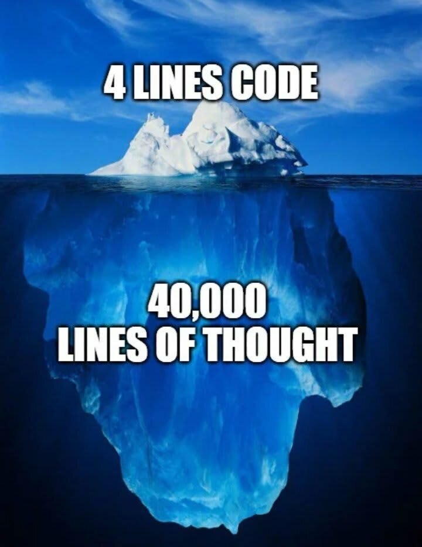

# Markdown Practice

## A doc to help us practice writing markdown

### We use this syntax to make bold text

- unordered list are made with - or \*
- unordered list are made with - or \*

### A locally hosted image

### A remote hosted image

We make a link like [This](https://www.google.com/)
